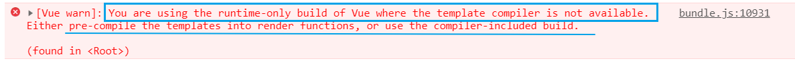

# Webpack使用教程（基础）

[TOC]

在开始之前，我们先来看以下Webpack官网首页给我们提供的图片，并思考一下该图片用意


## 一.Webpack基本介绍

### 1.1 概念的引入

**思考：在网页中，我们经常会引入哪些常见的静态资源**

> - JS
>   - .js  .jsx  .coffee  .ts（TypeScript  类 C# 语言）
>
> - CSS
>   - .css  .less   .sass  .scss
>
> - Images
>   - .jpg   .png   .gif   .bmp   .svg
>
> - 字体文件（Fonts）
>   - .svg   .ttf   .eot   .woff   .woff2
>
> - 模板文件
>   - .ejs   .jade  .vue【这是在webpack中定义组件的方式，推荐这么用】

**问题：网页中静态资源多了以后存在的问题**

> 1. 网页加载速度变慢，因为要多次重复的发送资源请求
> 2. 要处理错综复杂的依赖关系

**如何解决上述两个问题？**

> 1. 合并、压缩、精灵图、图片的Base64编码
> 2. 可以使用之前学过的requireJS、也可以使用webpack可以解决各个包之间的复杂依赖关系；


### 1.2 什么是Webpack

**<font color=red>核心定义：Webpack是一个模块打包工具</font>**

**Webpack是一个前端的<font color='red'>项目构建工具</font>，它是基于node.js开发出来的一个前端工具**

**如何实现上述的2种解决方案？**

> 1. 使用Gulp， 是基于 task 任务的；
> 2. 使用Webpack， 是基于整个项目进行构建的；
>
> - 借助于webpack这个前端自动化构建工具，可以完美**实现资源的合并、打包、压缩、混淆**等诸多功能。
> - 根据官网的图片介绍webpack打包的过程
> - [webpack官网](https://www.webpackjs.com/)


### 1.3 Webpack支持的规范

**Webpack支持以下规范**

1. CommonJS规范

~~~js
//moduleA.js 导出
module.exports = function(){
    //...
}

//moduleB.js 导入
var moduleA = require('./moduleA')
~~~

2. AMD规范（推崇依赖前置）

~~~js
//moduleA.js 导入和导出
define(['jquery','./math.js'],function($,math){
    //AMD是依赖前置，将文件的依赖通过数组的形式导入，然后当作函数的参数传递进函数使用
    
    //通过return来实现对外接口
    return helloWorld
})
~~~

3. CMD规范（推崇就近依赖，需要用到的时候再去加载模块）

   > 标准语法：define（id？，deps?，factory）
   > - 一个文件一个模块，所以经常用文件名作为模块id
   > - CMD推崇依赖就近，所以一般不在define的参数中写依赖，在factory中写
   > - factory是一个函数，该函数拥有三个参数 function（require，exports，module）
   >   - require：一个方法，接收模块标识，用来获取其它模块提供的接口
   >   - exports：一个对象，用来向外提供模块接口
   >   - module：一个对象，存储了与当前模块相关联的一些属性和方法

~~~js
define(fcuntion(require,exports,module){
       var $ = require('jquery.js')
       })
~~~

4. ES6规范

- 在ES6规范中，使用import和exports命令来导入和导出文件

~~~js
//moduleA.js 导出

//...内容区

//导出函数(还可以导出对象以及任何你想导出的数据类型)
exports.func = someFunc

//moduleB.js 导入
import func from './moduleA'
~~~

[掘金：AMD和CMD的区别](https://juejin.im/post/5a422b036fb9a045211ef789)


### 1.4 安装Webpack

1. 运行 `npm i webpack -g` 全局安装Webpack，这样就能在全局使用Webpack命令
   - 注意，如果是 `webpack4.0`以上的版本，需要全局安装 `Webpack-cli`
2. 在项目根目录运行 `npm i webpack --save-dev`安装到项目依赖中


### 1.5 命令行的使用

- **查看Webpack版本信息**

~~~shell
npm info webpack
~~~

- **安装指定版本的Webpack**

~~~shell
npm install webpack@版本号
~~~

- **卸载webpack**

~~~shell
npm uninstall webpack webpack-cli -g
~~~


## 二.Webpack基本使用

### 2.1 Webpack基本的使用方式-实例

**<font color='red'>目标：使用Webpack打包构建列表隔行变色案例</font>**

1. **创建基本的目录结构**

   webpack-study

   - dist
   - src
     - js文件夹
     - css文件夹
     - images文件夹
     - index.html
     - main.js

2. **在项目目录下面运行`npm init -y`初始化项目**

3. **使用 `npm i jquery --save` 安装jquery类库**

4. **创建main.js并书写隔壁行变色的代码逻辑**

   ~~~js
   main.js
   
   //导入jquery内库
   import $ from 'jquery'
   
   $(function(){
       $("li:odd").css('backgroundColor','red')
       $("li:even").css('backgroundColor','tomato')
   })
   ~~~

5. 在页面直接引用main.js会报错，因为浏览器不认识ES6的新语法import，需要**使用Webpack进行处理**，Webpack默认会把这种高级语法转换为低级浏览器能够识别的语法

6. 在package.json配置文件的scripts中添加dev的启动配置

   ~~~json
   "dev": "webpack"
   ~~~

7. **运行 `webpack 入口文件路径 输出文件路径` 对`main.js`进行打包编译**

   - 每次打包编译的时候，都会检查有没有dist目录，如果没有会自动帮我们创建dist目录，然后在dist目录下面帮我们生成`bundls.js`

   ~~~powershell
   webpack ./src/main.js ./dist/bundle.js
   ~~~

8. **在index.html中引入bundle.js代替main.js**

9. 使用 npm run dev 命令即可运行成功


### 2.2 Webpack基本配置

**<font color='red'>问题描述：</font>**

- **每次**修改文件之后，**都要**使用 `webpack 入口文件路径 输出文件路径`来对文件进行处理，使用起来比较**繁琐**

**<font color='red'>期待实现：</font>**

- **直接在控制台输入 webpack 命令**，即可自动完成文件的处理

**<font color='red'>实现方法</font>**

- 在项目根目录**添加Webpack的配置文件 webpack.config.js** 
  - 在Webpack配置文件里面**配置处理的入口文件和输出文件**
  - 配置完成之后，即可在调试台通过 webpack命令来对文件进行处理

~~~js
const path = require('path')


module.exports = {
    entry:path.join(__dirname,'./src/main.js'),

    output:{
        path:path.join(__dirname,'./dist'),
        filename:'bundle.js'
    }
}
~~~


## 三.webpack-dev-server的使用

### 3.1 实现自动打包编译

**<font color='red'>问题描述：每次改完代码，都需要手动执行`webpack`命令打包编译文件，比较繁琐</font>**

**目标：每次改完代码，我们点击保存之后就可以帮我们自动打包编译**

1. 安装 `webpack-dev-server`

   - -D 将该插件的依赖写入开发依赖中

   ~~~js
   npm install webpack-dev-server -D
   ~~~

2. 在 `package.json`里面的 `scripts`属性里面添加 `webpack-dev-server`命令到开发环境

   ~~~json
   "scripts": {
       "test": "echo \"Error: no test specified\" && exit 1",
       "dev": "webpack-dev-server"
     },
   ~~~

3. 在本地安装webpack，webpack-dev-server想要在本地项目中运行，必须在项目中也安装 webpack

   ~~~js
   npm install webpack -D
   ~~~

4. 执行 `npm run dev`命令即可,会有如下返回

   

5. 由第四步可知，webpack-dev-server帮我们生成的bundle.js运行于项目根目录，这个文件并没有存到物理磁盘上，而是托管到了电脑内存中，所以我们在项目中根本看不到这个bundle.js文件，但是我们可以通过将index.html中的bundle.js引用路径修改为项目根路径，即可引用到该文件

   ~~~Js
   <script src="/bundle.js"></script>
   ~~~

6. 可以认为 `webpack-dev-server` 把打包好的文件，以一种虚拟的形式，托管到了项目的根目录中，虽然我们看不到它，但是可以认为和 `dist，src，nodemodule`，平级，有一个看不见的文件，叫做`bundle.js`

**<font color='red'>注意：</font>**

- 若安装过程中有中断，需要把 node-modules文件夹删掉，重新执行 npm install下载依赖，否则会报错
- 最后执行npm run dev 之后，就会开始自动监听我们的修改，每次修改保存都会触发自动打包编译


### 3.2 额外的参数

`webpack-dev-server` 除了帮我们实现自动编译打包的功能之外，还可以添加 **额外的参数帮我们实现更强大的功能**

#### 方式1（推荐）：

- 项目启动后自动打开浏览器：`--open`
- 指定项目端口号：`--port 3000`
- 指定项目启动后的主页面：`--contentBase src`
- 指定热加载：`--hot`
  - 不加热加载之前，每次修改都会生成一个新的bundle.js
  - 加了热加载之后，每次都会在原基础上更新bundle.js，提升 效率

~~~json
//package.json

"scripts": {
    "test": "echo \"Error: no test specified\" && exit 1",
    "dev": "webpack-dev-server --open --port 3000 --contentBase src --hot"
  },
~~~

#### 方式2（了解即可）：

~~~js
//webpack.config.js

const webpack = require('webpack')	//引入Webpack，启用热更新的第2步

devServer:{     //设置dev-server命令参数的第二种形式，相对麻烦一些
        open:true,
        port:3000,
        contentBase:'src',
        hot:true    // 启用热更新的第一步
    },
    plugins:[       //配置插件的节点，热更新的第2步
        new webpack.HotModuleReplacementPlugin()    //new 一个热更新的模块对象，这是启用热更新的第3步
    ]
~~~


### 3.3 html-webpack-plugin插件

**<font color='red'>插件作用：</font>**

- **在内存中，生成HTML页面的插件**
- **将打包好的bundle.js插入页面中去，无需我们手动引入bundle.js**

**<font color='red'>插件用法：</font>**

1. **安装 html-webpack-plugin插件**

   ~~~js
   npm i html-webpack-plugin -D
   ~~~

2. **在webpack.config.js文件中添加插件**

   - 配置模版页面，即根据该模版页面生成内存中的页面
   - 指定生成页面的名称

   ~~~js
   //webpack.config.js
   
   const htmlWebpackPlugin = require('html-webpack-plugin')
   
   plugins:[ 
           new htmlWebpackPlugin({     //创建一个在内存中生成html页面的插件
               template:path.join(__dirname,'./src/index.html'),//指定模版页面，将来会根据指定的页面路径，去生成内存中的页面
               filename:'index.html'
           })
       ]
   ~~~

**<font color='red'>实际展示:</font>**


### 拓展：-S，-D，-g说明

> **npm install module_name -S**    即    npm install module_name –save    <font color='red'>写入dependencies</font>
>
> **npm install module_name -D**    即    npm install module_name –save-dev <font color='red'>写入devDependencies</font>
>
> **npm install module_name -g** 	全局安装(命令行使用)
>
> **npm install module_name** 		本地安装(将安装包放在 ./node_modules 下)

**<font color='red'>dependencies与devDependencies有什么区别呢？</font>**

- devDependencies 里面的插件只用于开发环境，不用于生产环境

- dependencies 是需要发布到生产环境的


## 四.loader的使用

**<font color='red'>注意：Webpack默认只能打包处理Js类型的文件，无法处理其它的非Js类型的文件</font>**

**<font color='red'>如果要处理非Js类型的文件，我们需要手动安装一些合适的第三方loader加载器</font>**

### 4.1 loader处理CSS样式表

1. **打包处理CSS文件：安装 style-loader css-loader**

   ```shell
   npm i style-loader css-loader -D
   ```

2. **在`webpack.config.js`配置文件里面新增`module`节点对象，在这个`module`对象身上，有个`rules`属性数组，这个数组中，存放了所有的第三方文件的匹配和处理规则**

   ```js
   module:{        //这个节点，用来配置所有第三方模块加载器
           rules:[     //配置第三方模块的匹配规则
               {test:/\.css$/,use:['style-loader','css-loader']}   //配置处理 .css文件的第三方loader规则
           ]
       }
   ```

3. **在main.js入口文件里面引入CSS文件即可成功使用**

   ```Js
   import './css/index.css'
   ```


### 4.2 loader处理URL地址

**问题描述：**

- 默认情况下，`Webpack`无法处理`CSS`文件中的URL地址，无论是图片还是字体库，只要是URL，都处理不了

**解决方法：**

- 通过安装 `url-loader file-loader`插件来对URL进行处理

  ~~~Js
  npm i url-loader file-loader -D
  ~~~

**使用步骤**

1. 安装 `url-loader file-loader`插件

2. 在`webpack.config.js`文件里面配置URL的处理规则

   - <font color='red'>参数介绍</font>
   - limit：图片的大小，单位是byte，如果引用的图片大于给定的limit值，则不会被转为`base64`格式的字符串， 如果 图片小于给定的 limit 值，则会被转为 `base64`的字符串
   - name：设置URL指定的路径名，默认会以hash值来命名（防止重名），可以通过如下方式通过hash值拼图片原始名的方式来达到同样的效果，且辨识度更高

   ~~~js
   //URL图片路径的匹配规则
   {test:/\.(jpg|jepg|png|gif)$/,use:'url-loader?limit=1000&name=[hash:8]-[name].[ext]'},
   //字体图标的匹配规则
   {test:/\.(eot|svg|woff|woff2|ttf)$/,use:'url-loader'}
   ~~~

   

### 4.3 拓展：Webpack处理第三方文件类型的过程

> 1. 先校验文件类型，如果是js文件直接打包
> 2. 如果非js文件，拿到后缀名，去webpack.config.js里面找对应匹配规则
> 3. 找到则调用规则打包，否则报错
> 4. rules的use规则数组从右到左调用，会将后面调用完毕的处理结果交给前面的规则继续处理
> 5. 调用完毕之后会将处理结果直接交给Webpack进行打包合并，最终输出到bundle.js中去

**示例：**

- 先使用`css-loader`插件进行处理，将处理结果交给`style-loader`继续处理

~~~js
 module: { 
    rules: [ 
      { test: /\.css$/, use: ['style-loader', 'css-loader'] }
    ]
  }
~~~

### 4.4 总结

- 由于`Webpack`默认只能打包处理`Js`类型的文件，无法处理其它的非`Js`类型的文件，所以如果要处理非`Js`类型的文件，我们需要手动安装一些合适的第三方`loader`加载器。

- 安装并使用第三方加载器的方法为以下几步

  1. 在命令行安装相对应的loader加载器（注意一般的loader加载器都有相对应的依赖模块，依赖模块同样也需要安装，否则程序会运行报错）
  2. 安装完对应的loader加载器之后，在Webpack.config.js配置文件中配置相对应的匹配规则

  ~~~js
  //添加module对象
  //在module对象里面添加rules数组
  //在rules数组里面添加相对应文件的匹配规则
  
  module:{
      rules:[
          {test:/\.css$/,use:['style-loader','css-loader']}
      ]
  }
  ~~~

  3. 如果有依赖的`CSS`或者其它文件，都以`import`命令的方式在入口`js`文件里面引入

- 完成以上步骤即可成功启用loader加载器


## 五.Babel的使用

> **在`Webpack`中，默认只能处理一部分`ES6`语法，一些更高级的`ES6`或者`ES7`语法，`Webpack`是处理不了的，这时候，就需要借助第三方loader，来帮助`Webpack`处理这些高级的语法，当第三方loader把高级语法转为低级的语法之后，会把结果交给`Webpack`去打包到`bundle.js`中**
>
> **通过Babel，可以帮助我们将高级语法转换为低级的语法**

### 5.1 安装

- **在Webpack中，可以运行如下两套命令，安装两套包，去安装Babel相关的loader功能**
  - <font color='red'>第一套包（类似于转换器）：</font>`cnpm i babel-core babel-loader babel-plugin-transform-runtime -D`
  - <font color='red'>第二套包（提供转换关系）：</font>`cnpm i bebel-preset-env babel-preset-stage-0 -D`

### 5.2 配置

- **在Webpack.config.js配置文件中，在module节点下的rules数组中添加一个新的匹配规则**

- **<font color='red'>注意：</font>**

  - 在配置的babel的loader规则的时候，一定要把node_modules目录通过exclude属性排除掉
  -  如果不排除node_modules,则Babel会把node_modules中所有的第三方Js文件都打包编译，这些会消耗CPU，并且导致打包速度非常慢
  - 哪怕最终babel把node_modules中的js全部转换完了，但是，项目也无法运行

  ~~~js
  {test:/\.js$/,use:'babel-loader',exclude:/node_modules/}
  ~~~

- **在项目的根目录中，新建一个叫做 `.babelrc` 的Babel配置文件**

  - 这个配置文件属于`json`格式，必须复核`JSON`语法规范，不能写注释，字符串必须使用双引号
  - 该配置文件可参照安装的两套包中的插件
  - 第一套包里面有个 `babel-plugin-transfrom`
  - 第二套包里面有 `babel-preset-env，babel-preset-stage-0`

  ~~~js
  {
      "presets":["env","stage-0"],
      "plugins":["transform-runtime"]
  }
  ~~~

- **完成以上配置，即可在项目中使用ES6语法，可以编写一个Class类，设置静态属性并打印它们来测试**


## 六.在Webpack中使用Vue

> **传统的Vue使用方式**
>
> 1. 通过 script标签引入 vue.js文件
> 2. 在body中声明一个盒子，并且为它设置一个id属性
> 3. 在script标签中通过new Vue（）创建一个VM实例

### 6.1 包的查找规则

> **当我们使用 import命令导入模块中的一个包的时候，它的查找规则是怎样的呢**
>
> 1. 找项目目录中有没有 node_modules 的文件夹
> 2. 在node_modules文件夹中找到对应的包名
> 3. 在package.json的配置文件里面，找到一个main属性【main属性指定了这个包在被加载的时候的入口文件】

接下来我们来试着导入一个vue包，并查看它对应的入口文件

- 安装 `npm i vue -D`

- 导入包 `import Vue form 'vue'`

- 查看 node_modules/vue/package.json中的main属性，看它的入口文件是哪个

  ~~~json
  "main": "dist/vue.runtime.common.js",
  ~~~

- 仔细回想一下，我们平时导入的是这个文件吗？显然不是，我们平时导入的是vue.js文件，那这里为什么会不一样呢？带着这个疑问，我们继续


### 6.2 尝试使用webpack的方式使用Vue

如下都是一些简单的代码模版，这里用代码说明，不做具体解释

~~~js
//main.js 入口文件

//此处导入的是 vue.runtime.common.js
import Vue from 'vue'

var login = {
    template:`<h1>Login success</h1>`
}

var vm = new Vue({
    el:'#app',
    data () {
        return {
            msg:'hello'
        }
    },
     components:{
         login
     }
})
~~~

~~~HTML
//index.html

<body>
    <div id="app">
        <p>{{msg}}</p>
        <login></login>
    </div>
</body>
~~~

**运行，查看结果**

- 发现报如下错误
- <font color='red'>您正在使用Vue的仅运行时版本，其中模板编译器不可用。</font>
  <font color='red'>将模板预编译为渲染函数，或使用包含编译器的构建。</font>



**错误分析**

- 以上错误告诉我们，正在使用的是vue运行时版本（即我们最开始看到的vue.runtime.common.js），编译器不可用

- 提供了<font color='red'>两种解决方法</font>
  1. 将模版预编译为渲染函数（使用render函数渲染模版）
  2. 使用包含编译器的构建（即完整的vue.js文件）

### 6.3 解决方法1

**<font color='red'>将模版预编译为渲染函数（使用render函数渲染模版）</font>**

渲染函数的使用，详情请看这里：[Render函数的使用](#)

通过尝试，发现把组件写在入口文件里面并不能达到目标，于是，我们抽取vue模版，通过vue文件来创建模版

1. 创建 login.vue文件

   ~~~vue
   <template>
   	<div>
           <h1>
               这是通过 vue 文件创建的模版
       	</h1>
       </div>
   </template>
   <script>
       
   </script>
   <style>
   
   </style>
   ~~~

2. 安装加载.vue文件的插件，并配置webpack.config.js

   ~~~js
   cnpm i vue-loader vue-template-compiler -D
   ~~~

   ~~~js
   //webpack.config.js
   
   const vueLoaderPlugin =require('vue-loader/lib/plugin')
   
    plugins:[
           new vueLoaderPlugin()
       ],
    module:{   
        rules:[
             {test:/\.vue$/,use:'vue-loader'},       //处理.vue文件
        ]         
    },
   ~~~

3. 在入口文件里面引入 login.vue,并使用render函数渲染

   ~~~js
   import Vue from 'vue'
   
   import login from './login.vue'
   
   var vm = new Vue({
       el:'#app',
       data () {
           return {
               msg:'hello'
           }
       },
       // render:function(createElement){
       //     return createElement(login)
       // },
       //简写
      render:c => c(login)
   })
   ~~~

4. 再次运行，发现运行成功

### 6.4 解决方法2

**<font color='red'>用包含编译器的构建（即完整的vue.js文件）</font>**

**修改原始导入的vue.runtime.common.js，将引入的包修改为vue.js**

- 有如下几种方法都可以修改vue.js的引入路径（推荐第三种方式）

1. 修改node_modules中的vue的package.json文件夹的main属性，将其指定为vue.js
2. 引入的时候修改引入路径为 `import Vue from '../node_modules/vue/dist/vue.js'`
3. 还是按照原先的引入方法 `import Vue form 'vue'`，但是需要在 webpack.config.js文件中增加如下配置

~~~Js
resolve:{
        alias:{
            "vue$":"vue/dist/vue.js"
        }
    }
~~~

- 完成以上设置之后，项目即可正常运行

### 6.5 总结

- **在Webpack中使用 Vue**
  1. 安装 Vue 的包：`npm i vue -S`
  2. 由于在Webpack中，推荐使用 .vue 这个组件 模版定义组件，所以需要安装能解析这种文件的loader：`npm i vue-loader vue-template-complier -D`
  3. 在 main.js 中导入 Vue模块：`Import Vue from 'vue'`
  4. 定义一个 .vue结尾的文件组件，该文件包含三个部分组成，template,script,style
  5. 在 main.js中使用 `Import login from './login.vue'`  命令导入这个组件
  6. 创建 vm实例，VM实例中使用渲染函数render来渲染页面
  7. 在页面中创建一个 id为app的div元素，作为VM要控制的区域


## 七.在Webpack中使用 Vue-Router

### 7.1 基本使用

1. 安装 vue-router依赖模块

   ```shell
   npm i vue -S
   npm i vue-router -S
   ```

2. 在main.js中引入Vue 和 vue-router模块,并显示的调用vue-router

   ```js
   import Vue from 'vue'
   import VueRouter from 'vue-router'
   Vue.use(VueRouter)
   ```

3. 在src目录下创建App.vue主页面模版文件

   ```vue
   <template>
       <div>
           <h1>APP组件</h1>
       </div>
   </template>
   
   <script>
   export default {
   
   
   }
   </script>
   
   <style>
   
   </style>
   ```

4. 在 index文件中 创建一个 id 属性等于 `app`的div元素

5. 在`src`目录下面新建文件夹，并在新建的文件夹下面创建`login.vue`和`register.vue`文件

6. 将`login.vue`和`register.vue`组件应用到`app`主页模板上面去

   ```Vue
   <template>
       <div>
           <h1>APP组件</h1>
           <router-link to='/login'>Login</router-link>
           <router-link to='/register'>Register</router-link>
   
           <router-view></router-view>
       </div>
   </template>
   
   <script>
   export default {
   
   
   }
   </script>
   
   <style>
   
   </style>
   ```

7. 在`main.js`文件中配置路由，创建`VM`实例，挂载`app`

   ```js
   import Vue from 'vue'
   import VueRouter from 'vue-router'
   
   Vue.use(VueRouter)
   
   import app from './App.vue'
   import login from './comp1/login.vue'
   import register from './comp1/register.vue'
   
   var router = new VueRouter({
       routes:[
           {path:'/login',component:login},
           {path:'/register',component:register}
       ]
   })
   
   var vm = new Vue({
       el:'#app',
       render: c => c(app),
       router
   })
   ```

8. 完成以上配置，启动项目即可


### 7.2 路由嵌套

在Webpack中使用路由的嵌套和在Vue中使用路由的嵌套基本类似

1. 在路由基本使用的前提下，创建两个新的组件 account,money

2. 在login组件中添加这两个组件的 <router-link>,并添加<router-view>容器

   ```vue
   <template>
       <div>
           <h1>Login success</h1>
   
           <router-link to='/login/account'>Account</router-link>
           <router-link to='/login/money'>Money</router-link>
   
           <router-view></router-view>
       </div>
   </template>
   ```

3. 在路由配置中给login添加children属性，配置account,money路由即可

   ```js
   var router = new VueRouter({
       routes:[
           {path:'/login',component:login,children:[
               {path:'account',component:account},
               {path:'money',component:money},
           ]},
           {path:'/register',component:register}
       ]
   })
   ```

   

### 7.3 抽离路由模块

为避免入口文件 main.js里面的内容过多，我们推荐使用抽离路由的方式，为router单独创建一个文件夹

- 在src目录下创建 router.js

  ```js
  import VueRouter from 'vue-router'
  
  import login from './comp1/login.vue'
  import register from './comp1/register.vue'
  import account from './comp2/account.vue'
  import money from './comp2/money.vue'
  
  var router = new VueRouter({
      routes:[
          {path:'/login',component:login,children:[
              {path:'account',component:account},
              {path:'money',component:money},
          ]},
          {path:'/register',component:register}
      ]
  })
  
  export default router
  ```

- 在main.js入口文件中，引入router.js暴露router对象，挂载到app即可

  ```js
  import Vue from 'vue'
  import VueRouter from 'vue-router'
  Vue.use(VueRouter)
  
  import app from './App.vue'
  import router from './router.js'
  
  var vm = new Vue({
      el:'#app',
      render: c => c(app),
      router
  })
  ```

  

### 7.4 组件中style标签lang属性和scoped属性

**<font color='red'>scoped属性：</font>**

- 在 .vue文件中，可通过style标签设置组件的样式，但是默认情况下，设置的样式会被渲染到全局
- 通过在 style标签中添加 scoped 属性，可以控制该样式只在该组件里面生效（建议使用）

**<font color='red'>lang属性：</font>**

- 在 .vue文件中，默认只能使用普通的 css样式语法，如果想要使用 scss，或者 less语法样式，需要给style标签设置 lang属性，并且指定具体的使用语法

  ```vue
  <style lang='less'>
  
  </style>
  ```


